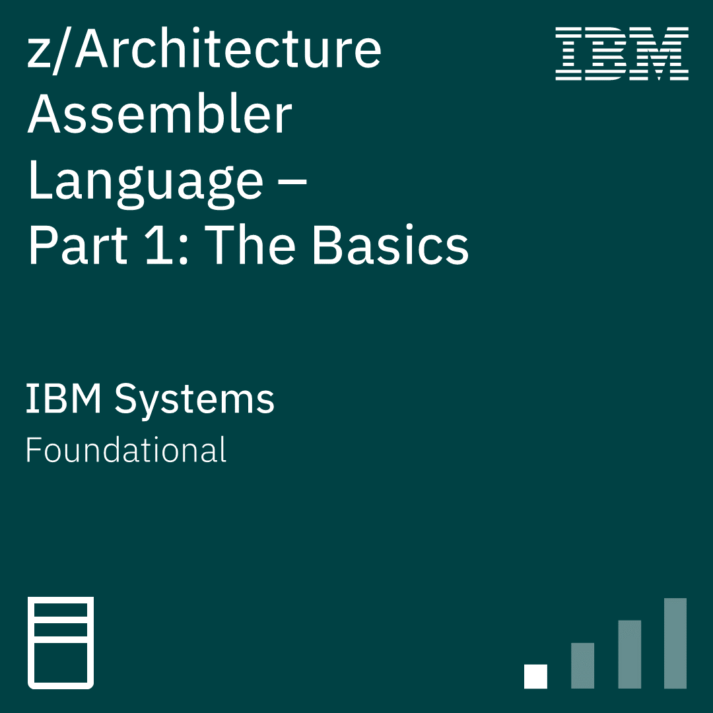
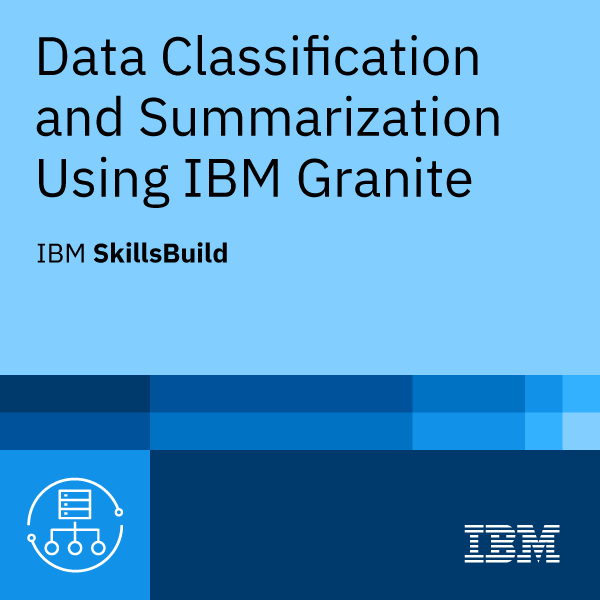
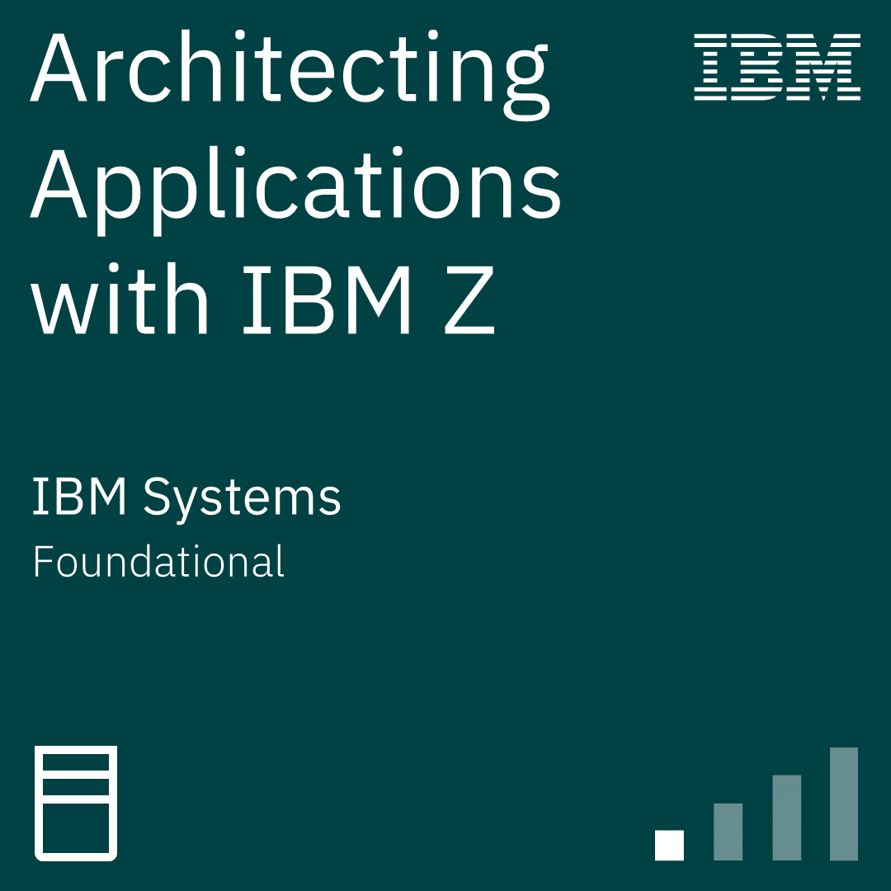
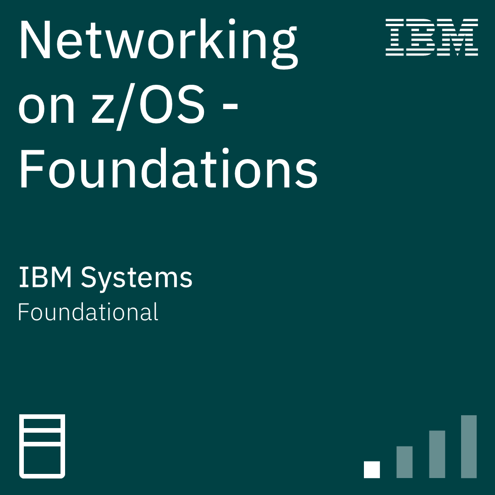
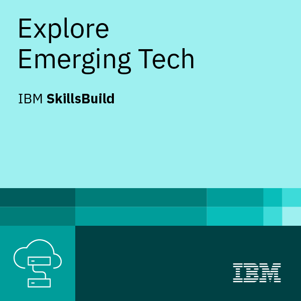

My name is Jason Gardner
==============================

Masters of Computing and Information Sciences Student
-----------------------------------------------------

I've been working on computers since I was a teenager. After a prior life as a reactor operator in the United States Navy, I began my journey to formalize that interest into a marketable skillset.

*   🌍  I'm based in Jacksonville, FL
*   ✉️  You can contact me at [n01480000@unf.edu](mailto:n01480000@unf.edu)
*   🧠  I'm currently learning IBM Mainframe Technologies (zOS, COBOL, JCL, Rexx)
*   👥  I'm looking to collaborate on Open Source Software

### Socials
                

 <a href="https://www.github.com/gardjl-unf" target="_blank" rel="noreferrer"> <picture> <source media="(prefers-color-scheme: dark)" srcset="https://raw.githubusercontent.com/danielcranney/readme-generator/main/public/icons/socials/github-dark.svg" /> <source media="(prefers-color-scheme: light)" srcset="https://raw.githubusercontent.com/danielcranney/readme-generator/main/public/icons/socials/github.svg" />  </picture> </a> <a href="https://discord.com/users/morbos" target="_blank" rel="noreferrer"> <picture> <source media="(prefers-color-scheme: dark)" srcset="https://raw.githubusercontent.com/danielcranney/readme-generator/main/public/icons/socials/discord-dark.svg" /> <source media="(prefers-color-scheme: light)" srcset="https://raw.githubusercontent.com/danielcranney/readme-generator/main/public/icons/socials/discord.svg" />  </picture> </a> <a href="https://www.facebook.com/jason.l.gardner" target="_blank" rel="noreferrer"> <picture> <source media="(prefers-color-scheme: dark)" srcset="https://raw.githubusercontent.com/danielcranney/readme-generator/main/public/icons/socials/facebook-dark.svg" /> <source media="(prefers-color-scheme: light)" srcset="https://raw.githubusercontent.com/danielcranney/readme-generator/main/public/icons/socials/facebook.svg" />  </picture> </a>

### Badges

<b>My GitHub Stats</b>

## Verified badges

<!--START_SECTION:badges-->

  
  
  
  
  
  
  
  
  
  
  
  
  
  
  
  
  
  
  
  
  
  
  
  
  
  
  
  
  
  
  
  
  
  
  
  
  
  
  
  
  
  
  
  
  
  
  
  
  
  
  
  
  
  
  
  
  
  
  
  
  
  
  
  
  
  
  
  
  
  
  
  
  
  
  
  
  
  
  
  
  
  
  
  
  
  
  
  
  
  
  
  
  
  
  

<!--END_SECTION:badges-->

